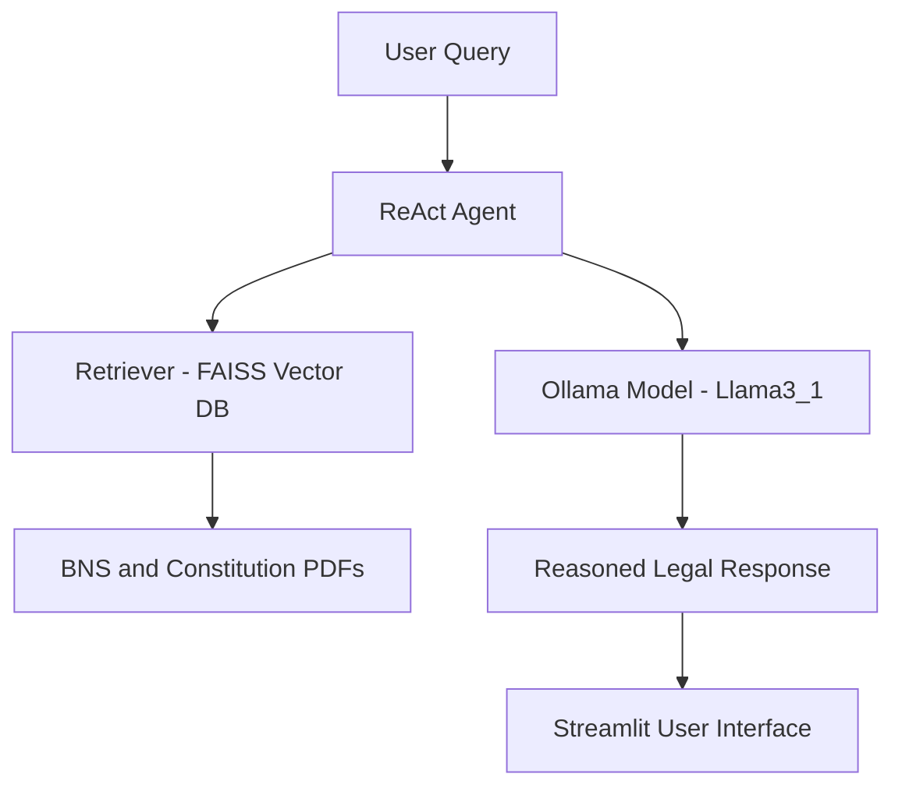

# ⚖️ LexBNS – Bharatiya Nyaya Sanhita Legal Assistant

> 🧠 **An offline, privacy-focused AI assistant** for the *Bharatiya Nyaya Sanhita (BNS), 2023* and the *Constitution of India* — powered entirely by **local Ollama LLMs**.

---
## 👨‍💻 Developers (Contributors) – Contact for Collaborations 🤝

<table align="center">
  <tr>
    <td align="center">
      <br>
      <b>Gokul Ram K</b><br>
      <i>Software Developer • NLP Engineer</i><br>
      <a href="mailto:gokul.ram.kannan210905@gmail.com">gokul.ram.kannan210905@gmail.com</a><br><br>
      
    </td>
    <td align="center">
      <br>
      <b>Aishwarya Sreenivasan</b><br>
      <i>Software Developer • ML Engineer </i><br>
      <a href="mailto:aishwarya.sreenivasan2023@vitstudent.ac.in">aishwarya.sreenivasan2023@vitstudent.ac.in</a><br><br>
      
    </td>
    <td align="center">
      <br>
      <b>Shyam Karthinathan</b><br>
      <i>System Designer • Testing Engineer </i><br>
      <a href="mailto:shyamkarthinathan.p2023@vitstudent.ac.in">shyamkarthinathan.p2023@vitstudent.ac.in</a><br><br>
      
    </td>
  </tr>
</table>

---

> 🧑‍🏫 **Project Guide:**  
> **Dr. Sajidha A** – Assistant Professor & Research Supervisor  
> *Vellore Institute of Technology, Chennai Campus*  
> 


## 📸 Preview

| ⚖️ **LexBNS – Your Local Legal Assistant** |
|:-------------------------------------------:|
| *(Add your screenshot here — e.g., assets/lexbns_ui.png)* |

---

## 🚀 Overview

LexBNS is an **AI-powered legal assistant** that helps users query and interpret India’s **Bharatiya Nyaya Sanhita (BNS), 2023** and the **Constitution of India** — fully **offline**.

It builds upon advanced NLP concepts such as:

- ⚙️ **RAG (Retrieval-Augmented Generation)** – retrieves relevant legal sections  
- 🧩 **ReAct (Reason + Act)** – enables reasoning + contextual retrieval  
- 🔍 **FAISS Vector Database** – for fast semantic search  
- 💻 **Ollama LLMs** – for 100 % local inference (e.g., `llama3.1:8b`)

---

## 🧩 Why LexBNS?

| **Problem** | **LexBNS Solution** |
|:-------------|:--------------------|
| Legal documents are vast and complex | Uses **semantic retrieval** to extract relevant BNS sections |
| Internet-based models risk privacy | Runs **completely offline** via Ollama |
| Chatbots give surface-level replies | Incorporates **ReAct reasoning** for multi-step, contextual answers |
| Difficult to search by section or article | Employs **FAISS embeddings** for legal-term matching |

---

## 🧱 Architecture



---

> The user’s query passes through the **ReAct reasoning loop**,  
> which interacts with a **FAISS-based retriever** and the **local Ollama model**  
> to produce structured, context-aware legal answers.

---

## ⚙️ Setup Guide

> 💡 **LexBNS runs fully offline — no API keys, no internet required.**

---

### ✅ Works On:
- 🪟 **Windows 10 / 11**
- 🐧 **Linux (Ubuntu / Debian)**
- 🍎 **macOS**
- Requires **Python ≥ 3.10**

---

### 🪜 Step 1: Clone the Repository

```bash
git clone https://github.com/GOKULRAM-K/Legal_Bot.git
cd Legal_Bot
```
### ⚙️ Step 2: Install Dependencies

```bash
pip install -r requirements.txt
```
### 🦙 Step 3: Install & Start Ollama

Then in terminal
```bash
ollama serve
ollama pull llama3.1:8b
```

> 🟢 Once Ollama is running, your local model (like llama3.1:8b) will be available for LexBNS to process queries.

### 💻 Step 4: Run LexBNS

```bash
streamlit run app.py
```
---

## 🧠 How It Works

LexBNS combines **retrieval**, **reasoning**, and **generation** to produce legally accurate and context-aware answers — even for nuanced queries.

| 🪜 **Step** | ⚙️ **Description** |
|:-----------:|:------------------|
| **1️⃣** | The user enters a query, e.g., *“What is Section 103 under BNS?”* |
| **2️⃣** | The **ReAct agent** interprets the question and decides what data is needed |
| **3️⃣** | The **FAISS retriever** searches through stored embeddings of BNS and Constitution PDFs |
| **4️⃣** | The **Ollama model (Llama3.1)** reasons using retrieved context to generate a coherent legal explanation |
| **5️⃣** | The **Streamlit UI** displays a structured, well-formatted response with context |

> 🧩 This hybrid ReAct + RAG pipeline ensures LexBNS not only retrieves the right information,  
> but also *understands* and *explains* it in clear legal language.

---

## 📂 Project Structure

Here’s the breakdown of the LexBNS directory:

| 📁 **Folder / File** | 🧾 **Description** |
|-----------------------|--------------------|
| `app.py` | Streamlit-based frontend for interactive chat UI |
| `agent.py` | Core ReAct + RAG logic for legal question answering |
| `tools/data/` | Source legal documents — `BNS.pdf`, `constitution.pdf` |
| `db/` | Pre-built FAISS vector indexes for fast semantic retrieval |
| `tools/pdf_query_tools_.py` | Handles PDF reading, embedding, and vector database interactions |
| `react_prompt_template.py` | Defines reasoning templates used by the agent |
| `.env` | (Optional) Environment file for configuration |
| `requirements.txt` | Python dependencies list |
| `Dockerfile` | Container setup (optional for deployment) |
| `README.md` | Project documentation (you’re reading it!) |

> 🗂️ The codebase is modular — you can easily plug in new legal PDFs (like BNSS or BSA)  
> to expand LexBNS into a more comprehensive legal assistant.

---

## ✨ Key Features

LexBNS has been designed to provide a balance between **accuracy**, **privacy**, and **usability**, ensuring seamless interaction for both law students and professionals.

| 💡 **Feature** | 🧾 **Description** |
|:---------------|:------------------|
| 🧑‍⚖️ **Dual Legal Knowledge Base** | Answers questions from both *Bharatiya Nyaya Sanhita (BNS, 2023)* and *The Constitution of India*. |
| 🧠 **Offline LLM Inference** | Runs fully on local hardware using **Ollama**, with no internet or API key required. |
| 🔍 **Smart Legal Retrieval** | Uses **FAISS vector database** for semantic search — matches meaning, not just keywords. |
| 🧩 **ReAct + RAG Hybrid Logic** | Employs reasoning before retrieval to improve accuracy and contextual understanding. |
| 💬 **Interactive Chat Interface** | Built with **Streamlit**, featuring chat memory and modern UI design. |
| 🛡️ **Privacy-First Approach** | No data is sent to any cloud API — ideal for legal and confidential environments. |
| 🧱 **Modular & Extendable** | Easily add more Indian legal acts (BNSS, BSA, etc.) to the system. |
| ⚙️ **Cross-Platform Support** | Works seamlessly on Windows, macOS, and Linux. |

---

## 🎓 Technologies Used

LexBNS integrates modern machine learning, natural language processing, and UI tools into one cohesive application:

| 🧩 **Category** | 🛠️ **Tools / Libraries** |
|-----------------|--------------------------|
| 💬 **LLM Backend** | Ollama (local Llama3.1:8b), LangChain |
| 🧠 **Retrieval** | FAISS (Facebook AI Similarity Search), HuggingFace Embeddings |
| 🧾 **Data Source** | Bharatiya Nyaya Sanhita (2023), Constitution of India PDFs |
| 🖥️ **Frontend** | Streamlit (Chat-based web interface) |
| 🧰 **Language / Frameworks** | Python 3.12, dotenv, PyPDF2 |
| 🧪 **Environment / Deployment** | Docker (optional), .env configuration |

> 🔧 LexBNS runs efficiently even on mid-range systems —  
> the `llama3.1:8b` model is optimized for strong reasoning with manageable memory usage.

---

> ⚖️ *LexBNS represents a step toward accessible, explainable, and privacy-conscious AI in Indian legal research.*

---


